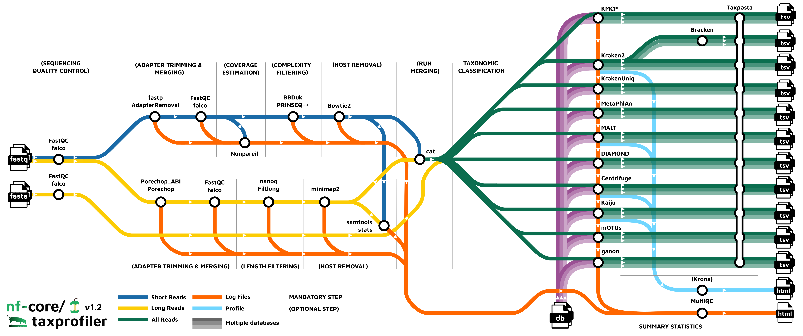

<h1>
  <picture>
    <source media="(prefers-color-scheme: dark)" srcset="docs/images/nf-core-taxprofiler_logo_custom_dark.png">
    
  </picture>
</h1>

[](https://github.com/nf-core/taxprofiler/actions/workflows/ci.yml)
[](https://github.com/nf-core/taxprofiler/actions/workflows/linting.yml)[](https://nf-co.re/taxprofiler/results)[](https://doi.org/10.5281/zenodo.7728364)
[](https://www.nf-test.com)

[](https://www.nextflow.io/)
[](https://docs.conda.io/en/latest/)
[](https://www.docker.com/)
[](https://sylabs.io/docs/)
[](https://cloud.seqera.io/launch?pipeline=https://github.com/nf-core/taxprofiler)

[](https://nfcore.slack.com/channels/taxprofiler)[](https://twitter.com/nf_core)[](https://mstdn.science/@nf_core)[](https://www.youtube.com/c/nf-core)

[](https://doi.org/10.1101/2023.10.20.563221)

## Introduction

**nf-core/taxprofiler** is a bioinformatics best-practice analysis pipeline for taxonomic classification and profiling of shotgun short- and long-read metagenomic data. It allows for in-parallel taxonomic identification of reads or taxonomic abundance estimation with multiple classification and profiling tools against multiple databases, and produces standardised output tables for facilitating results comparison between different tools and databases.

## Pipeline summary



1. Read QC ([`FastQC`](https://www.bioinformatics.babraham.ac.uk/projects/fastqc/) or [`falco`](https://github.com/smithlabcode/falco) as an alternative option)
2. Performs optional read pre-processing
   - Adapter clipping and merging (short-read: [fastp](https://github.com/OpenGene/fastp), [AdapterRemoval2](https://github.com/MikkelSchubert/adapterremoval); long-read: [porechop](https://github.com/rrwick/Porechop), [Porechop_ABI](https://github.com/bonsai-team/Porechop_ABI))
   - Low complexity and quality filtering (short-read: [bbduk](https://jgi.doe.gov/data-and-tools/software-tools/bbtools/), [PRINSEQ++](https://github.com/Adrian-Cantu/PRINSEQ-plus-plus); long-read: [Filtlong](https://github.com/rrwick/Filtlong)), [Nanoq](https://github.com/esteinig/nanoq)
   - Host-read removal (short-read: [BowTie2](http://bowtie-bio.sourceforge.net/bowtie2/); long-read: [Minimap2](https://github.com/lh3/minimap2))
   - Run merging
3. Supports statistics metagenome coverage estimation ([Nonpareil](https://nonpareil.readthedocs.io/en/latest/)) and for host-read removal ([Samtools](http://www.htslib.org/))
4. Performs taxonomic classification and/or profiling using one or more of:
   - [Kraken2](https://ccb.jhu.edu/software/kraken2/)
   - [MetaPhlAn](https://huttenhower.sph.harvard.edu/metaphlan/)
   - [MALT](https://uni-tuebingen.de/fakultaeten/mathematisch-naturwissenschaftliche-fakultaet/fachbereiche/informatik/lehrstuehle/algorithms-in-bioinformatics/software/malt/)
   - [DIAMOND](https://github.com/bbuchfink/diamond)
   - [Centrifuge](https://ccb.jhu.edu/software/centrifuge/)
   - [Kaiju](https://kaiju.binf.ku.dk/)
   - [mOTUs](https://motu-tool.org/)
   - [KrakenUniq](https://github.com/fbreitwieser/krakenuniq)
   - [KMCP](https://github.com/shenwei356/kmcp)
   - [ganon](https://pirovc.github.io/ganon/)
5. Perform optional post-processing with:
   - [bracken](https://ccb.jhu.edu/software/bracken/)
6. Standardises output tables ([`Taxpasta`](https://taxpasta.readthedocs.io))
7. Present QC for raw reads ([`MultiQC`](http://multiqc.info/))
8. Plotting Kraken2, Centrifuge, Kaiju and MALT results ([`Krona`](https://hpc.nih.gov/apps/kronatools.html))

## Usage

> [!NOTE]
> If you are new to Nextflow and nf-core, please refer to [this page](https://nf-co.re/docs/usage/installation) on how to set-up Nextflow.Make sure to [test your setup](https://nf-co.re/docs/usage/introduction#how-to-run-a-pipeline) with `-profile test` before running the workflow on actual data.

First, prepare a samplesheet with your input data that looks as follows:

`samplesheet.csv`:

```csv
sample,run_accession,instrument_platform,fastq_1,fastq_2,fasta
2612,run1,ILLUMINA,2612_run1_R1.fq.gz,,
2612,run2,ILLUMINA,2612_run2_R1.fq.gz,,
2612,run3,ILLUMINA,2612_run3_R1.fq.gz,2612_run3_R2.fq.gz,
```

Each row represents a fastq file (single-end), a pair of fastq files (paired end), or a fasta (with long reads).

Additionally, you will need a database sheet that looks as follows:

`databases.csv`:

```csv
tool,db_name,db_params,db_path
kraken2,db2,--quick,/<path>/<to>/kraken2/testdb-kraken2.tar.gz
metaphlan,db1,,/<path>/<to>/metaphlan/metaphlan_database/
```

That includes directories or `.tar.gz` archives containing databases for the tools you wish to run the pipeline against.

Now, you can run the pipeline using:

```bash
nextflow run nf-core/taxprofiler \
   -profile <docker/singularity/.../institute> \
   --input samplesheet.csv \
   --databases databases.csv \
   --outdir <OUTDIR>  \
   --run_kraken2 --run_metaphlan
```

> [!WARNING]
> Please provide pipeline parameters via the CLI or Nextflow `-params-file` option. Custom config files including those provided by the `-c` Nextflow option can be used to provide any configuration _**except for parameters**_; see [docs](https://nf-co.re/docs/usage/getting_started/configuration#custom-configuration-files).

For more details and further functionality, please refer to the [usage documentation](https://nf-co.re/taxprofiler/usage) and the [parameter documentation](https://nf-co.re/taxprofiler/parameters).

## Pipeline output

To see the results of an example test run with a full size dataset refer to the [results](https://nf-co.re/taxprofiler/results) tab on the nf-core website pipeline page.
For more details about the output files and reports, please refer to the
[output documentation](https://nf-co.re/taxprofiler/output).

## Credits

nf-core/taxprofiler was originally written by James A. Fellows Yates, Sofia Stamouli, Moritz E. Beber, Lili Andersson-Li, and the nf-core/taxprofiler team.

### Team

- [James A. Fellows Yates](https://github.com/jfy133)
- [Sofia Stamouli](https://github.com/sofstam)
- [Moritz E. Beber](https://github.com/Midnighter)
- [Lili Andersson-Li](https://github.com/LilyAnderssonLee)

We thank the following people for their contributions to the development of this pipeline:

- [Lauri Mesilaakso](https://github.com/ljmesi)
- [Tanja Normark](https://github.com/talnor)
- [Maxime Borry](https://github.com/maxibor)
- [Thomas A. Christensen II](https://github.com/MillironX)
- [Jianhong Ou](https://github.com/jianhong)
- [Rafal Stepien](https://github.com/rafalstepien)
- [Mahwash Jamy](https://github.com/mjamy)

### Acknowledgments

We also are grateful for the feedback and comments from:

- The general [nf-core/community](https://nf-co.re/community)

And specifically to

- [Alex Hübner](https://github.com/alexhbnr)

❤️ also goes to [Zandra Fagernäs](https://github.com/ZandraFagernas) for the logo.

## Contributions and Support

If you would like to contribute to this pipeline, please see the [contributing guidelines](.github/CONTRIBUTING.md).

For further information or help, don't hesitate to get in touch on the [Slack `#taxprofiler` channel](https://nfcore.slack.com/channels/taxprofiler) (you can join with [this invite](https://nf-co.re/join/slack)).

## Citations

If you use nf-core/taxprofiler for your analysis, please cite it using the following doi: [10.1101/2023.10.20.563221](https://doi.org/10.1101/2023.10.20.563221).

> Stamouli, S., Beber, M. E., Normark, T., Christensen II, T. A., Andersson-Li, L., Borry, M., Jamy, M., nf-core community, & Fellows Yates, J. A. (2023). nf-core/taxprofiler: Highly parallelised and flexible pipeline for metagenomic taxonomic classification and profiling. In bioRxiv (p. 2023.10.20.563221). https://doi.org/10.1101/2023.10.20.563221

For the latest version of the code, cite the Zenodo doi: [10.5281/zenodo.7728364](https://doi.org/10.5281/zenodo.7728364)

An extensive list of references for the tools used by the pipeline can be found in the [`CITATIONS.md`](CITATIONS.md) file.

You can cite the `nf-core` publication as follows:

> **The nf-core framework for community-curated bioinformatics pipelines.**
>
> Philip Ewels, Alexander Peltzer, Sven Fillinger, Harshil Patel, Johannes Alneberg, Andreas Wilm, Maxime Ulysse Garcia, Paolo Di Tommaso & Sven Nahnsen.
>
> _Nat Biotechnol._ 2020 Feb 13. doi: [10.1038/s41587-020-0439-x](https://dx.doi.org/10.1038/s41587-020-0439-x).
